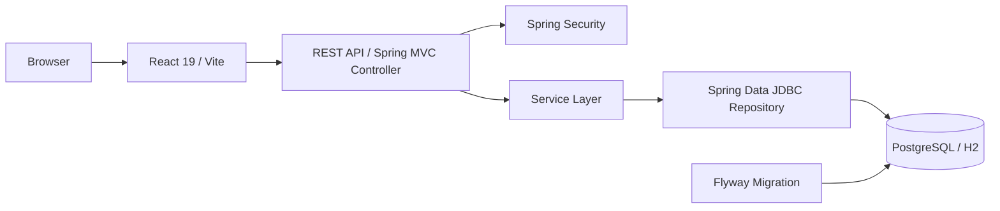
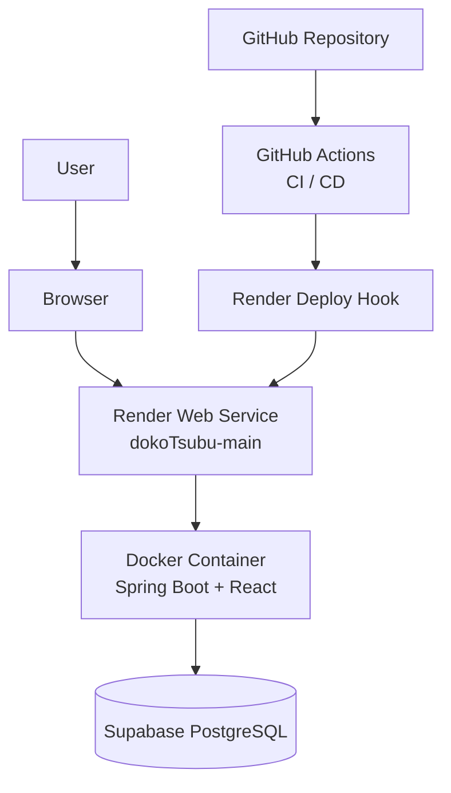
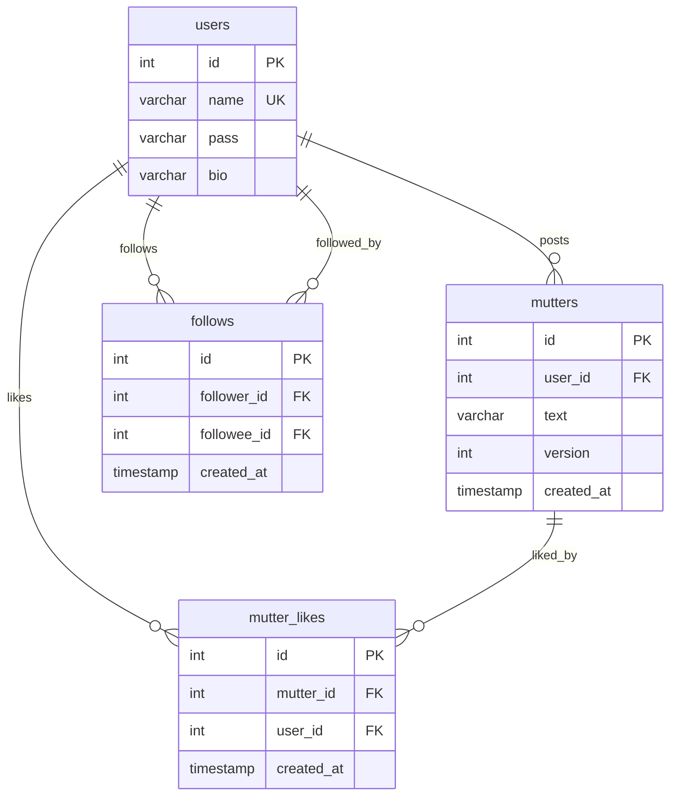

# つぶやきアプリ（dokoTsubu）

[](https://github.com/kmymyshr/dokoTsubu/actions/workflows/ci.yml)

Java Servlet / JSP をベースに作成したミニSNS「dokoTsubu」を、Spring Boot・Spring Security・Flyway・Spring Data JDBC・Service層・React + REST API 構成へ段階的に移行したWebアプリケーションです。

ユーザー登録、ログイン、投稿、検索、編集、削除、いいね、フォローなどの基本的なSNS機能を備えています。現在は、主要画面をReactで表示し、バックエンドはSpring Boot上のREST APIとService層で処理する構成になっています。

## デモ

- URL: https://dokotsubu-main-staging.onrender.com/dokoTsubu/
- Health Check: https://dokotsubu-main-staging.onrender.com/dokoTsubu/health
- テストユーザー:
  - ID: `demo_user1`
  - Password: `demoPass_101!`

Renderのサービス表示名は `dokoTsubu-main` です。公開URLは、既存のRenderサブドメインを継続利用しているため `dokotsubu-main-staging.onrender.com` のまま運用しています。

## 主な機能

- ユーザー登録
- ログイン / ログアウト
- 投稿一覧表示
- 投稿作成
- 投稿検索
- 投稿編集
- 投稿削除
- いいね
- フォロー / フォロー解除
- フォロー中 / フォロワー一覧
- プロフィール表示
- 自己紹介編集
- 5秒ごとの投稿一覧自動更新
- CSRF対策
- 投稿更新時の楽観ロック

## 使用技術

| 分類 | 技術 |
| --- | --- |
| Language | Java 21 |
| Backend | Spring Boot 3.5 / Spring Security 6.5 / Spring Data JDBC / Jakarta Servlet 6 |
| Frontend | React 19 / Vite |
| Database | PostgreSQL / H2 / Flyway |
| Build | Maven |
| Container | Docker / Embedded Tomcat 10.1 |
| Deploy | Render |
| CI/CD | GitHub Actions / Render Deploy Hook |
| Test | JUnit 5 / Mockito / Vitest |

## 現在の構成

```text
Browser
  |
React
  |
REST API / Spring MVC Controller
  |
Spring Boot / Spring Security
  |
Service
  |
Spring Data JDBC Repository / Query Repository
  |
PostgreSQL / H2
```

画面表示はReact、業務処理はService層、データアクセスはSpring Data JDBC Repository / Query Repositoryへ分離しています。

初期のServlet / JSP構成から段階的に移行した経緯があるため、一部に互換用のServletやブリッジ構成は残っています。ただし、主要な画面表示・認証・API・Service・DBアクセスはSpring Boot中心の構成へ整理済みです。

## 技術構成図



Reactが画面表示とユーザー操作を担当し、バックエンドはSpring Boot上のAPI、Security、Service、Repositoryに責務を分けています。DBスキーマはFlywayで管理します。

## システム構成図



`main` ブランチへのマージ後、GitHub ActionsでCIを実行し、成功後にCDワークフローからRender Deploy Hookを呼び出します。Render上ではDockerコンテナとしてSpring Bootアプリを起動し、Supabase PostgreSQLへ接続します。

## ER図



`mutter_likes` は `(mutter_id, user_id)` にUNIQUE制約を持ち、同じユーザーが同じ投稿へ重複していいねできないようにしています。`follows` は `(follower_id, followee_id)` にUNIQUE制約を持ち、同じフォロー関係の重複を防いでいます。

## ディレクトリ構成

```text
.
├── frontend/
│   └── src/
│       ├── App.jsx
│       ├── main.jsx
│       └── components/
├── src/
│   ├── main/
│   │   ├── java/
│   │   │   ├── api/
│   │   │   ├── com/example/dokotsubu/
│   │   │   │   ├── config/
│   │   │   │   ├── persistence/
│   │   │   │   ├── security/
│   │   │   │   ├── service/
│   │   │   │   └── web/
│   │   │   ├── dao/
│   │   │   ├── dto/
│   │   │   └── model/
│   │   └── resources/
│   │       └── db/migration/
│   └── test/
├── Dockerfile
├── render.yaml
└── pom.xml
```

主な役割は次のとおりです。

- `frontend/src/`: React画面、APIクライアント、フロントエンドテスト
- `src/main/java/api/`: Reactから呼び出すJSON API Servlet
- `src/main/java/com/example/dokotsubu/web/`: 画面入口とヘルスチェック用Controller
- `src/main/java/com/example/dokotsubu/security/`: Spring Security設定
- `src/main/java/com/example/dokotsubu/service/`: ユーザー、投稿、ソーシャル機能のService層
- `src/main/java/com/example/dokotsubu/persistence/`: Spring Data JDBC Repository、読み取り用Repository、Entity
- `src/main/resources/db/migration/`: Flywayマイグレーション

## ローカル実行

標準設定では、ローカルのH2 Serverを使用します。起動後、次のURLへアクセスします。

```text
http://localhost:8080/dokoTsubu/
```

アプリケーションを起動します。

```shell
mvn spring-boot:run
```

ポートを変えて起動したい場合は、環境変数 `PORT` を指定します。

```powershell
$env:PORT="8081"
mvn spring-boot:run
```

H2をインメモリDBとして使う場合は、次のように指定できます。

```powershell
$env:DB_URL="jdbc:h2:mem:dokotsubu-local;DB_CLOSE_DELAY=-1"
$env:DB_USER="sa"
$env:DB_PASSWORD=""
$env:FLYWAY_BASELINE_ON_MIGRATE="false"
mvn spring-boot:run
```

PowerShellで `npm` が実行ポリシーによりブロックされる場合は、`npm.cmd` を使います。

```powershell
cd frontend
npm.cmd test -- --run
npm.cmd run build
cd ..
```

## PostgreSQLでの実行

PostgreSQLなど別のデータベースを使用する場合は、環境変数で接続先を指定します。

```text
DB_URL=jdbc:postgresql://localhost:5432/dokotsubu
DB_USER=dokotsubu
DB_PASSWORD=change-me
DB_MAXIMUM_POOL_SIZE=10
FLYWAY_BASELINE_ON_MIGRATE=false
PORT=8080
```

Dockerでは次のように起動できます。

```shell
docker build -t dokotsubu .
docker run --rm -p 8080:8080 \
  -e DB_URL=jdbc:postgresql://host.docker.internal:5432/dokotsubu \
  -e DB_USER=dokotsubu \
  -e DB_PASSWORD=change-me \
  dokotsubu
```

## データベースマイグレーション

アプリケーション起動時にFlywayが `src/main/resources/db/migration` のマイグレーションを検証・適用します。

新規データベースでは、`V1__initial_schema.sql` からスキーマを作成します。適用履歴は `flyway_schema_history` テーブルで管理します。

既存のPostgreSQLをFlyway管理へ移す場合は、次の手順で一度だけベースライン化します。

1. データベースをバックアップする
2. `db/migration/postgresql_baseline_preflight.sql` を実行する
3. 不整合件数がすべて0で、テーブル・列・制約がV1と一致することを確認する
4. 初回起動時だけ `FLYWAY_BASELINE_ON_MIGRATE=true` を設定する
5. `flyway_schema_history` にバージョン1のBaselineが記録されたことを確認する
6. 以降は `FLYWAY_BASELINE_ON_MIGRATE=false` に戻す

既存のマイグレーションファイルは変更せず、今後のスキーマ変更は `V2__...sql`、`V3__...sql` のように新しいファイルとして追加します。

## テスト

Java側とReact側を含めた検証は、Mavenからまとめて実行できます。

```shell
mvn --batch-mode --no-transfer-progress clean verify
```

Reactのみ確認する場合は、次のコマンドを使います。

```powershell
cd frontend
npm.cmd test -- --run
npm.cmd run build
cd ..
```

CIではGitHub Actionsにより、`main` ブランチへのpushと `main` 向けPull Requestを対象に次の検証を実行します。

- Javaテスト
- Reactテスト
- Vite本番ビルド
- WARファイル生成
- Dockerイメージビルド確認

## デプロイ

Render上の `dokoTsubu-main` サービスへDockerデプロイしています。

```text
Render service: dokoTsubu-main
Branch: main
Runtime: Docker
Plan: Starter
Database: main用Supabase PostgreSQL
Context path: /dokoTsubu
Health check: /dokoTsubu/health
Public URL: https://dokotsubu-main-staging.onrender.com
```

GitHub ActionsのCDワークフローは、`main` のCI成功後にRender Deploy Hookを呼び出します。Render側のAuto-Deployは `Off` とし、GitHub Actions CD経由に一本化しています。

必要なGitHub Repository Secretは次のとおりです。

```text
RENDER_DEPLOY_HOOK_URL=<RenderのDeploy Hook URL>
```

手動でCDを実行する場合は、GitHubの `Actions` タブから `CD` ワークフローを選び、`Run workflow` を実行します。

## 移行で整理した主な内容

このプロジェクトでは、従来型のServlet / JSPアプリケーションを、段階的に現在の構成へ移行しました。

- Spring Boot化
- Spring Securityによる認証・認可の一元管理
- FlywayによるDBマイグレーション管理
- Spring Data JDBCへの移行
- Service層の導入
- React + REST APIへの画面移行
- JSPホストの廃止とSpring MVC Controller生成HTMLへの移行
- GitHub Actions CIの構築
- GitHub Actions CD + Render Deploy Hookの構築
- Render + Supabase PostgreSQLによるmain環境の運用整理

## 工夫した点

### 段階的なReact移行

既存のServlet / JSPアプリケーションを一度に作り直すのではなく、REST APIを追加しながら画面単位でReactへ移行しました。既存機能を壊しにくくしながら、徐々にフロントエンドとバックエンドの責務を分離しています。

### セキュリティ

- Spring Securityでログイン、ログアウト、URL認可を一元管理
- Spring Securityのセッション方式でCSRF対策を実装
- APIでは未認証とCSRFエラーをJSONで返却
- パスワードをBCryptでハッシュ化
- 認証成功時にセッションIDを変更
- 更新時の楽観ロックで同時編集による競合を防止

### データ整合性

PostgreSQLでは、外部キー制約、UNIQUE制約、NOT NULL制約でデータ整合性を保証します。スキーマはFlywayで管理し、環境差分が出にくいようにしています。

### 保守性

- Servlet / API、Service、Repositoryの責務を分離
- DTOを利用してAPIレスポンスを整理
- 複雑な読み取りSQLを専用Repositoryに集約
- Spring Data JDBCにより基本CRUDとトランザクションをSpring管理へ移行
- 移行意図が後から追えるよう、主要ファイルに役割・処理ブロックのコメントを追加

## 現段階の状態

現段階では、ミニSNSとしての基本機能、React画面、認証、DBマイグレーション、CI/CD、Renderデプロイまで一通り動作する状態です。

学習・ポートフォリオ用途のWebアプリとしては、いったん完成とみなせる段階です。

一方で、実運用サービスとして長期的に育てる場合は、次の改善余地があります。

## 今後検討したいこと

- 旧互換用Servlet / DAO / ブリッジ構成のさらなる整理
- APIをServletからSpring MVC Controllerへ移行
- 画面UI/UXの改善
- レスポンシブデザインの調整
- 入力バリデーションとエラーメッセージの改善
- テストデータ投入手順の整備
- E2Eテストの導入
- Service層とReactコンポーネントのテスト拡充
- ログ出力と監視の改善
- 独自ドメイン設定
- RenderサービスURLの正式名称化
- 旧public環境と旧Supabase DBの整理
- GitHub Actions CD後のデプロイ成功確認の自動化

## 学習を通して

本プロジェクトでは、従来型のJava Webアプリケーションをベースに、React、REST API、Docker、PostgreSQL、Spring Security、Flyway、Spring Data JDBC、Service層を組み合わせながら、段階的にモダンな構成へ移行しました。

機能追加だけでなく、保守性、セキュリティ、データ整合性、CI/CDで検証できる設計を重視しています。
